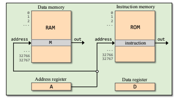

# 1 불 논리

Nand 게이트
| A | B | A NAND B |
|---|---|----------|
| 0 | 0 |    1     |
| 0 | 1 |    1     |
| 1 | 0 |    1     |
| 1 | 1 |    0     |


Not 게이트
```hdl
CHIP Not {
    IN in;
    OUT out;

    PARTS:
    Nand(a=in,b=in, out=out);
}

```

Or 게이트
```hdl
CHIP Or {
    IN a, b;
    OUT out;

    PARTS:
    Not(in=a,out=nota);
    Not(in=b,out=notb);
    And(a=nota,b=notb,out=tmp);
    Not(in=tmp,out=out);
}
```

Xor 게이트
```hdl
CHIP Xor {
    IN a, b;
    OUT out;

    PARTS:
    Not(in=a,out=nota);
    Not(in=b,out=notb);
    And(a=a,b=notb,out=and1);
    And(a=nota,b=b,out=and2);
    Or(a=and1,b=and2,out=out);
}
```

Mux 게이트
```hdl
CHIP Mux {
    IN a, b, sel;
    OUT out;

    PARTS:
    Not(in=sel,out=notsel);
    And(a=a,b=notsel,out=and1);
    And(a=b,b=sel,out=and2);
    Or(a=and1,b=and2,out=out);
}
```
DMux 게이트
```hdl
CHIP DMux {
    IN in, sel;
    OUT a, b;

    PARTS:
    Not(in=sel,out=notsel);
    And(a=in,b=notsel,out=a);
    And(a=in,b=sel,out=b);
}
```

---

# 2 불 연산

반가산기
```hdl
CHIP HalfAdder {
    IN a, b;  // 1비트 입력
    OUT sum,       // 합
        carry;     // 자리올림

    PARTS:
    Xor(a=a,b=b,out=sum);
    And(a=a,b=b,out=carry);
}
```

가산기
```hdl
CHIP FullAdder {
    IN a, b, c;  // 1비트 입력
    OUT sum,       // 합
        carry;     // 자리올림

    PARTS:
    HalfAdder(a=a,b=b,sum=ab,carry=ab_carry);
    HalfAdder(a=ab,b=c,sum=sum,carry=abc_carry);
    Or(a=ab_carry,b=abc_carry,out=carry);
}
```
ALU
```hdl
CHIP ALU {
    IN x[16], y[16], zx, nx, zy, ny, f, no;
    OUT out[16], zr, ng;
    PARTS:
    Mux16(a=x, b=false, sel=zx, out=xval1);         /* if zx then x=0 */
    Not16(in=xval1, out=notxval);
    Mux16(a=xval1, b=notxval, sel=nx, out=xval);    /* if nx then x=!x */
    Mux16(a=y, b=false, sel=zy, out=yval1);         /* if zy then y=0 */
    Not16(in=yval1, out=notyval);
    Mux16(a=yval1, b=notyval, sel=ny, out=yval);    /* if ny then y=!y */
    Add16(a=xval, b=yval, out=sum);
    And16(a=xval, b=yval, out=and);
    Mux16(a=and, b=sum, sel=f, out=out1);           /* if f then out=x+y else out=x&y */
    Not16(in=out1, out=notout);
    Mux16(a=out1, b=notout, sel=no, out=out2);      /* if no then out=!out */
    Or16Way(in=out2, out=outnonzero);
    Mux(a=true, b=false, sel=outnonzero, out=zr);   /* if out=0 then zr=1 else zr=0 */
    IsNeg16(in=out2, out=neg);
    Mux(a=false, b=true, sel=neg, out=ng);          /* if out<0 then ng=1 else ng=0 */
    Or16(a=out2, b=false, out=out);
}
```
---

# 3 메모리

조합 칩 - 시간과 무관한 칩

순차 칩 - 시간에 무관한 조합 칩과 달리, 현재 시점의 입력 뿐만 아니라 이전에 처리했던 입력 및 출력에도 영향을 받음

## 클록

틱 톡 이라는 2진 신호를 연속적으로 생성하는 것 => 클록

틱의 시작과 톡의 종료 사이의 시간 => 주기


## DFF(데이터 플립 플롭)

DFF란 out(t) = in(t-1) 이라는 식을 만족하는 칩

순차 칩의 가장 기본적인 형태

DFF는 이전의 입력을 기억하고, 현재 입력을 다음 클록 신호에 전달

즉, 현재 출력은 이전 클록 신호의 입력과 같음

---

ALU에  x + y를 계산하는 명령을 내렸다고 가정할 때, x는 근처 레지스터의 값이고 y는 멀리 위치한 RAM 레지스터의 값이라고 가정

x,y의 전기신호가 ALU에 도착하는 시점이 서를 다를 가능성이 높음

=> 컴퓨터 아키텍처 내에서 비트 하나가 가장 긴 경로를 따라 전송되는 시간과, 칩 내에서 가장 오래 걸리는 계산 시간을 더한 것보다 클록 주기가 더 길면 모든 연산이 올바르게 작동할 수 있음


## 레지스터

### bit

Bit 레지스터의 역할

1비트 데이터 저장: 입력값을 클럭 신호의 상승 엣지(또는 하강 엣지)에 따라 저장한다.

상태 유지: 클럭 신호가 없으면 이전 상태를 유지한다.


```
load = 1이면 현재 입력값이 출력으로 저장,
load = 0이면 이전 출력값이 유지.
```
레지스터의 기본 단위: 여러 개의 Bit 레지스터를 조합해 다비트 레지스터(예: 8비트, 16비트)를 구성한다.

```hdl
CHIP Bit {
    IN in, load;
    OUT out;

    PARTS:
    Mux(a=dffout, b=in, sel=load, out=muxout);
	DFF(in=muxout, out=dffout);
	Or(a=dffout, b=dffout, out=out);
}
```

### register

레지스터의 역할

여러 비트 데이터 저장: 여러 비트 레지스터를 조합해 다비트 레지스터를 구성한다.

상태 유지: 클럭 신호가 없으면 이전 상태를 유지한다.

레지스터의 상태를 읽으려면 out값을 읽으면 된다.

레지스터의 상태를 v로 설정하려면 입력 in에 v를 넣고 load를 1로 설정하면 된다.

```hdl
CHIP Register {
    IN in[16], load;
    OUT out[16];

    PARTS:
    Bit(in=in[0], load=load, out=out[0]);
    Bit(in=in[1], load=load, out=out[1]);
    Bit(in=in[2], load=load, out=out[2]);
    Bit(in=in[3], load=load, out=out[3]);
    Bit(in=in[4], load=load, out=out[4]);
    Bit(in=in[5], load=load, out=out[5]);
    Bit(in=in[6], load=load, out=out[6]);
    Bit(in=in[7], load=load, out=out[7]);
    Bit(in=in[8], load=load, out=out[8]);
    Bit(in=in[9], load=load, out=out[9]);
    Bit(in=in[10], load=load, out=out[10]);
    Bit(in=in[11], load=load, out=out[11]);
    Bit(in=in[12], load=load, out=out[12]);
    Bit(in=in[13], load=load, out=out[13]);
    Bit(in=in[14], load=load, out=out[14]);
    Bit(in=in[15], load=load, out=out[15]);
}
```

### RAM

RAM은 "랜덤 액세스(Random Access)"라는 이름에서 알 수 있듯, 모든 메모리 셀에 동일한 시간에 접근할 수 있도록 설계된 메모리

RAM의 랜덤 액세스가 가능한 이유는 어드레스 라인(Address Line)과 데이터 라인(Data Line)의 병렬 처리 덕분

#### RAM의 역할

여러 비트 데이터 저장: 여러 비트 레지스터를 조합해 다비트 레지스터를 구성한다.

상태 유지: 클럭 신호가 없으면 이전 상태를 유지한다.

주소 지정: 주소를 지정해 해당 주소에 데이터를 저장하거나 읽는다.

#### 데이터 입력

주소를 지정하고 데이터를 입력하려면 in에 데이터를 넣고 load를 1로 설정하면 된다.

#### 데이터 출력

주소를 지정하고 데이터를 읽으려면 load는 0이여야하고, address에 주소를 넣으면 된다.


```hdl
CHIP RAM8 {
    IN in[16], load, address[3];
    OUT out[16];

    PARTS:
	DMux8Way(in=load, sel=address, a=loada, b=loadb, c=loadc, d=loadd, e=loade, f=loadf, g=loadg, h=loadh);
    Register(in=in, load=loada, out=outa);
    Register(in=in, load=loadb, out=outb);
    Register(in=in, load=loadc, out=outc);
    Register(in=in, load=loadd, out=outd);
    Register(in=in, load=loade, out=oute);
    Register(in=in, load=loadf, out=outf);
    Register(in=in, load=loadg, out=outg);
    Register(in=in, load=loadh, out=outh);
	Mux8Way16(a=outa, b=outb, c=outc, d=outd, e=oute, f=outf, g=outg, h=outh, sel=address, out=out);	
}
```

### Counter

카운터는 주어진 제어비트에 입력 따라 카운트 값을 증가시키거나 특정 값으로 변경하거나 초기화하는 칩

카운터의 역할

카운트 값 증가: inc 신호가 1이면 카운트 값을 1 증가시킨다.

카운트 값 변경: load 신호가 1이면 카운트 값을 in 으로 변경한다.

카운트 값 초기화: reset 신호가 1이면 카운트 값을 0으로 초기화한다.

pc 값 확인 : out으로 pc값을 확인할 수 있다.

```
16-bit counter with load and reset controls.
 If reset(t-1) then out(t) = 0
    else if load(t-1) then out(t) = in(t-1)
         else if inc(t-1) then out(t) = out(t-1) + 1 (integer addition)
              else out(t) = out(t-1)
 
```

```hdl
CHIP PC {
    IN in[16],load,inc,reset;
    OUT out[16];

    PARTS:
	Inc16(in=regout, out=plusone);
	Mux16(a=false, b=plusone, sel=inc, out=incout);
	Mux16(a=incout, b=in, sel=load, out=loadout);
	Mux16(a=loadout, b=false, sel=reset, out=toload);
	Or(a=load, b=reset, out=loadorreset);
	Or(a=loadorreset, b=inc, out=loadflag);
    Register(in=toload, load=loadflag, out=regout);
	Or16(a=regout, b=regout, out=out);
}
```


# 4 기계어

기계어는 전체 컴퓨터 시스템에서 가장 기본이 되는 인터페이스로, 하드웨어와 소프트웨어가 만나는 접점이다.


## 기계어 : 개요

기계어 프로그램은 2진과 기호의 두 가지 버전으로 동일하게 작성될 수 있다.

예를 들어 "R1 + R2 의 값을 R1에 설정하라" 라는 추상화 연산이 있다고 가정할 때

6비트 코드 101011로 덧셈 연산을, 각각 00001과 00010이라는 코드로 레지스터 R1과 R2를 표현하도록 언어를 설계할 수 있을 것이다.

이 코드를 왼쪽에서 오른쪽으로 조합해서 16비트 명령어 1010110001000001을 만들고, 이 코드를 "R1 + R2 의 값을 R1에 설정하라" 라는 명령어로 해석할 수 있다.

이러한 2진 코드를 기호로 표현하면 "ADD R1 R2"가 된다.

이러한 기호 기계어를 어셈블리어(Assembly Language)라고 부르며 이를 2진 코드로 변환하는 프로그램을 어셈블러(Assembler)라고 부른다.

## 핵 기계어

이 책의 최종 목표인 핵 컴퓨터는 폰노이만 구조를 따른다.

핵은 16비트 컴퓨터인데, 이 말은 곧 cpu와 메모리 장치가 16비트 값들을 처리하고, 이동하고, 저장하도록 설계되었다는 뜻이다.



### 메모리
핵 플랫폼은 데이터 메모리아와 명령어 메모리 2개의 개별 메모리를 활용한다.

데이터 메모리(RAM) : 프로그램이 조작하는 2진 값을 저장한다.

명령어 메모리(ROM) : 2진 값으로도 표현되는 프로그램의 명령어들을 저장한다.

두 메모리는 폭이 16비트이며, 각각 2^15개의 메모리 셀을 가진다.(0 ~ 32K - 1 의 주소 지정 가능한 메모리가 일렬로 나열되어 있음)

### 데이터 메모리
핵 명령어는 선택된 RAM 레지스터에서 데이터를 읽거나 쓰도록 명령할 수 있다.

메모리의 address입력에는 항상 어떤 값이 들어가기 떄문ㅇ, 하나의 레지스터가 늘 선택되며, 그 레지스터는 핵 명령어에서 M으로 참조된다.

M = 0 이라는 명령어는 선택된 RAM 레지스터에 0을 설정하라는 뜻이다.

### 명령어 메모리

명령어 메모리의 주소 입력에는 항상 어떤 값이 들어간다. 따라서 명령어 메모리 레지스터가 늘 하나 선택된다.

### 레지스터

핵 명령어는 3개의 16비트 레지스터, 즉 데이터 레지스터 (D), 주소 레지스터 (A), 선택된 메모리 레지스터 (M)를 조작하도록 설계되었다.

문법은 다음처럼 사용된다.

```
D = 0; // D 레지스터에 0을 설정
D = M; // D 레지스터에 M 레지스터의 값 설정
D = A; // D 레지스터에 A 레지스터의 값 설정
D = -1; // D 레지스터에 -1을 설정
D = D + 1; // D 레지스터의 값을 1 증가
```

D : 16비트 값을 저장한다.
A : 주소 레지스터 또는 데이터 레지스터 두 가지 역할을 한다. 값 17을 A에 저장하려면 @17을 사용한다.

### 주소지정

핵 명령어 @xxx는 A 레지스터에 값 xxx를 설정한다.

또한 @xxx 명령어는 추가적인 기능이 두 가지 더 있다.

첫번쨰는 주소가 xxx인 RAM 레지스터를 '선택된 메모리 레지스터 M' 으로 만드는 것이다.

두번째는 주소가 xxx인 ROM 레지스터 값을 '선택된 명령어가 되게 한다.


RAM[100] 의 값을 17로 설정

```
@17
D = A
@100
M = D
```

### 분기

0;JMP 무조건 점프

D;JGT D가 0이면 점프

### 변수

@xxx에서 xxx는 상수나 기호 모두 가능


